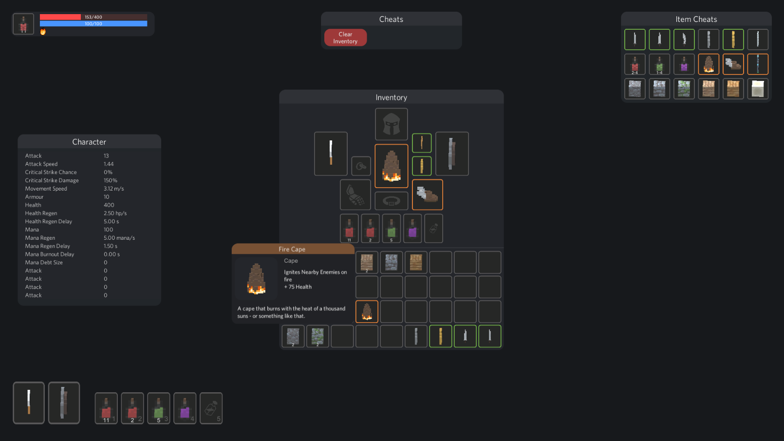
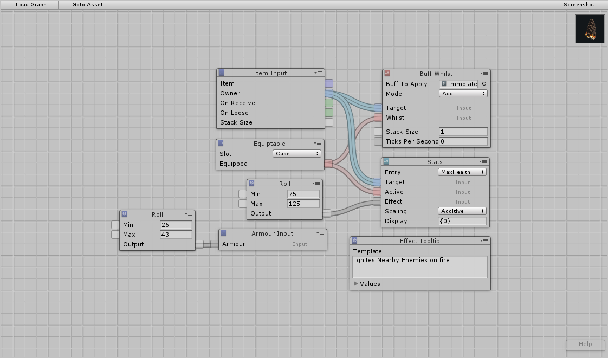
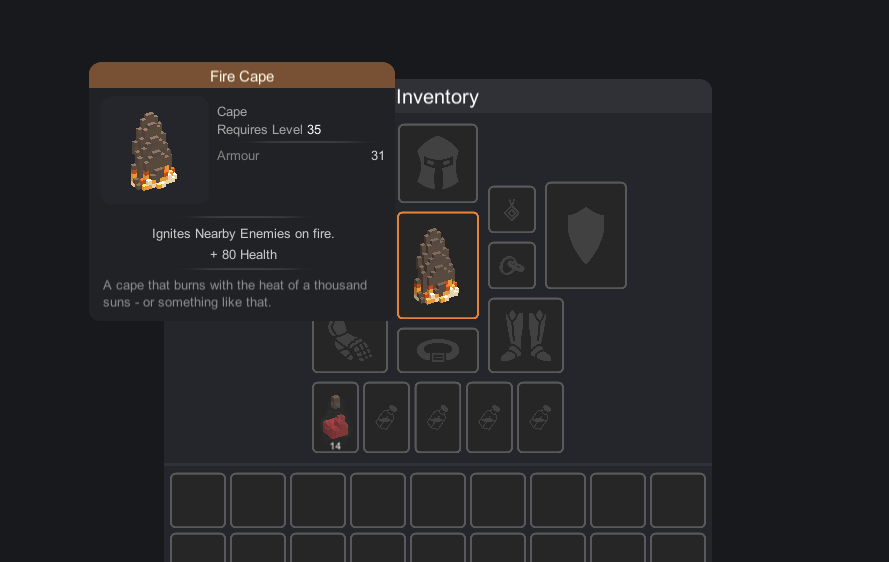

<h1>

RPGCore
</h1>

**RPGCore** is a toolkit for producing games and mechanics in **C#**.

  
  <i>The Unity demo project.</i>

## 📦 Libraries

>  \
> _Polymorphic data serialization._

>  \
> _Data file editing API._

>  \
> _Value wrappers and collections with events._

>  \
> _Loading pre-packaged content._

>  \
> _Authoring pre-packaged content and build pipelines._

>  \
> _File system abstraction with file change events._

>  \
> _Modular Entity-Component-System for games._

>  \
> _Data-driven mechanics._

>  \
> _Inventories that contain, store, and move items._

>  \
> _Modular implementation of RPG items._

>  \
> _RPG character stats and item stats._

## 🔍 Overview

At it's core, this project features a behaviour system that's used to create modular items and buffs. The behaviour system is setup using a visual scripting tool, shown below.

  
  <i>The graph editor for the 'Fire Cape' item.</i>

RPGCore is built around a modular behaviour system. One of the core uses for this system is **modular items**.

Below is an item called the 'Fire Cape'. It applies the Immolate buff to it's owner, which deals damage to nearby enemies.

This graph in the game is interpreted by the tooltip system, which renders the 'Fire Cape' tooltip as shown below.

  
  <i>The tooltip for the 'Fire Cape' item.</i>

## License

This work is licensed under a [Creative Commons Attribution-NonCommercial 4.0 International License](http://creativecommons.org/licenses/by-nc/4.0/).
