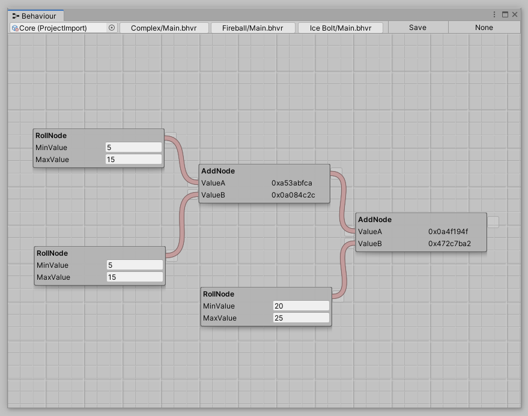

<h1>

RPGCore
</h1>

RPGCore is a toolkit for producing RPG games and mechanics in C#.

- [RPGCore.Data](./src/libs/RPGCore.Data/README.md)

## The "Rewrite"

 

The "Rewrite" project delivers the following features:

- A **high-performance** and extensible node-based **behaviour system**
- Unity-independent code-base that can run on servers
- Intuitive **API for creating custom nodes**

## The "Prototype"

 

> "Many screenshots of RPGCore are from the "Prototype" project. I don't recommend anyone use this project commercially unless they understand it and are willing to modify it to suit their needs. This code has no multiplayer compatibility (yet) and uses a lot of lambda expressions to accomplish the node connections."

At it's core, this project features a behaviour system that's used to create modular items and buffs. The behaviour system is setup using a visual scripting tool, shown below.

RPGCore is built around a modular behaviour system. One of the core uses for this system is **modular items**.

Below is an item called the "Fire Cape". It applies the Immolate buff to it's owner, which deals damage to nearby enemies.

This graph in the game is interpreted by the tooltip system, which renders the "Fire Cape" tooltip as shown below.

## License

This work is licensed under a [Creative Commons Attribution-NonCommercial 4.0 International License](http://creativecommons.org/licenses/by-nc/4.0/).
