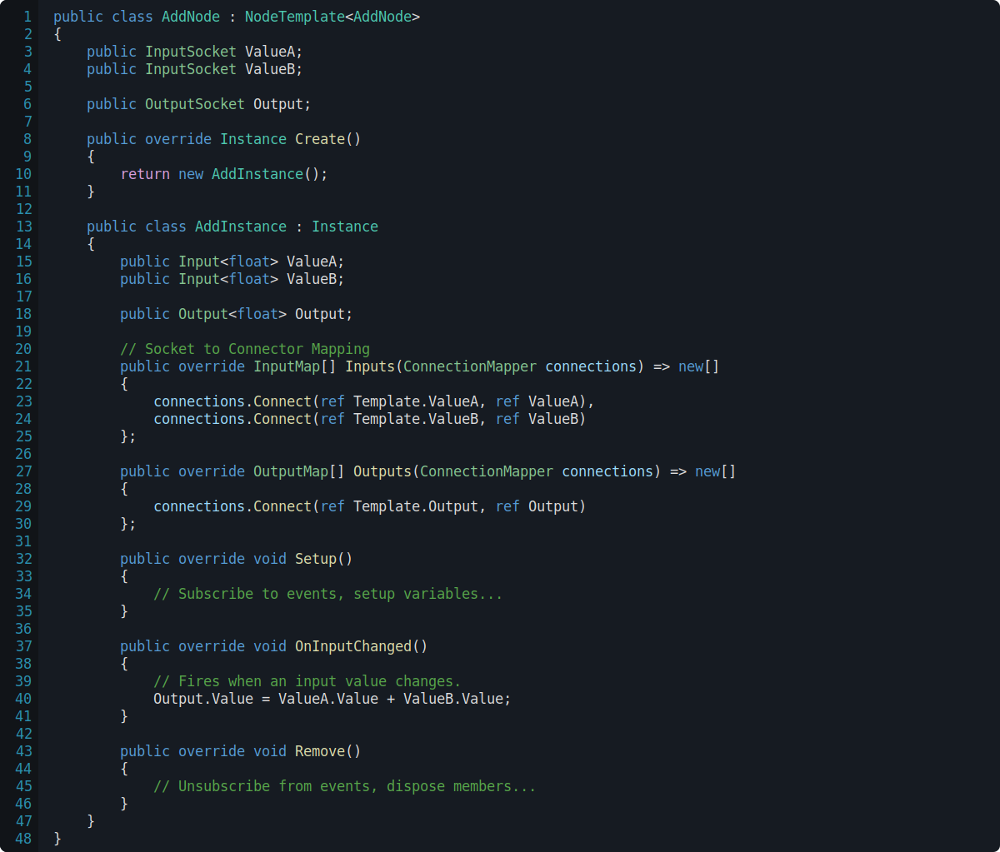

<h1>

RPGCore.Behaviour
</h1>

RPGCore.Behaviour is a mechanism for creating node-based graphs that drive gameplay and behaviour.

## RPGCore.Behaviour

Custom nodes are created by inheriting a the `NodeTemplate` class.

