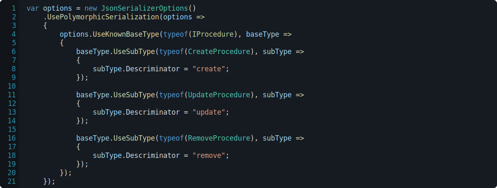

<h1>

RPGCore.Data
</h1>

Serialization standards and support for RPGCore.

## RPGCore.Data.Polymorphic

Serialization supports polymorphic types for serialized objects.

The descrminator used to determine what type the object is included in the Json output.

### Resolving subtypes automatically

Subtypes for a known base type can be determined via reflection at runtime using the `ResolveSubTypesAutomatically` method.

When a `RemoveProcedure` from the previous sample is serialized the following json is produced.

### Registering subtypes explicitly

Subtypes for a known base type can be explicitly registered and configured on a per-type basis.

When a `RemoveProcedure` from the previous sample is serialized the following json is produced.

## RPGCore.Data.Polymorphic.Inline

Attributes can be used to declare what types should serialize to preserve object types.

When a type that inherits from this `IProcedure` is serialized, the following json is produced.

### Explicit type naming

An explicit set of types that are serializable can be declared ahead-of-time.

Attributes can also be used on the child types.

Using either of the previous demos, when a `RemoveProcedure` is serialized the following json is produced.

