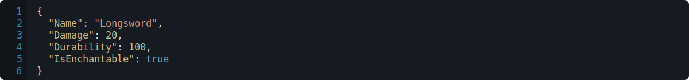
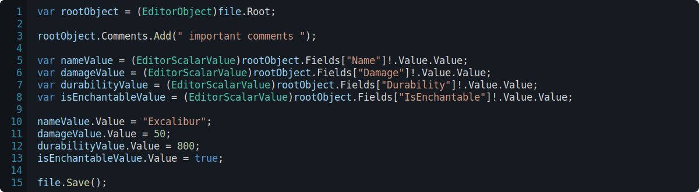
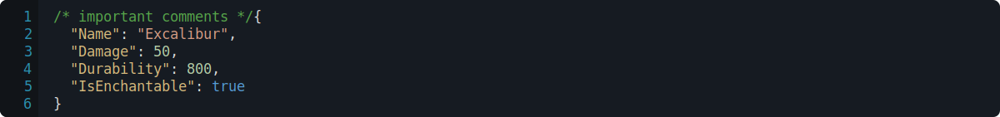

<h1>

RPGCore.DataEditor
</h1>

RPGCore.DataEditor is a mechanism for editing arbitrary data files.

A file provides the data editor with a mechanism for saving and loading data into an editor.

## Creating a Manifest

The `EditorSession` needs to be configured before it can be used. To configure an `EditorSession`, you require a schema. Schemas tell the `EditorSession` about what sort of data structures are involved and what types are valid for this data.

The easiest way to create a schema is by using your types defined in .NET classes. This is done using the `UseTypesFromJsonSerializer` extension method. This method takes the configuration from a serializer and uses it to add types to the schema.

You can also create a schema for types that don't exist as .NET classes. This can allow you editor arbitrary Json.

## Saving Manifests for later usage

Once you have created your schema, you can export it to a file. This allows you to ship new versions of the schema (and thus also the data structures) to an arbitrary data editor without having to rebuild your editor.

This also has the advantage of making your data editor independant of your gameplay code (requiring no dependencies).

A above code will create the following manifest.

## Using a Manifest to Edit a File

Once you have got a schema that contains all of the data types that you want to be able to modify; we can start to edit files using it.

Let's begin by looking at the data that we want to be able to edit.

We then need to create a file. A file represents a destination that the data editor can read/write from/to.

A file can source it's data from the file system (using a pre-built implementation `FileSystemFile`) or it can have a custom cloud-based implementation when working with editing web-hosted data.

This will load a default value for the _'Weapon'_ type, which will look something like this.

Now that we have a file, we can begin to edit it using the data editor APIs.

When the file is saved; the following Json is outputted.

> ⚠ _The current Json writer is built ontop of `System.Text.Json`, which doesn't support writing well-formatted comments. See [https://github.com/dotnet/runtime/issues/52408](https://github.com/dotnet/runtime/issues/52408) for more._
>
> _I'm considering creating a custom Json writer that has better support for writing comments._
